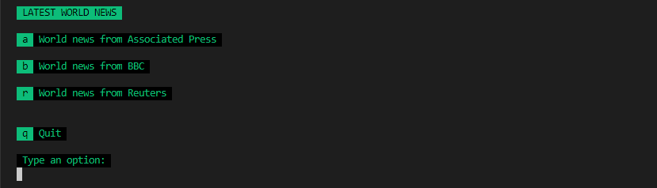
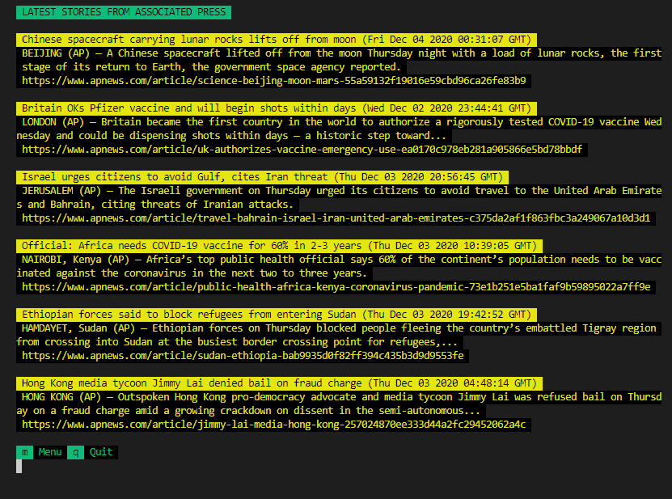

# News Scraper

> Terminal news scraper in Ruby.




A scraper developed in Ruby that scrapes the latest news from three sources: AP, BBC and Reuters websites.

## Built With

- Ruby
- Bundle
- Nokogiri
- RSpec
- Rubocop


## Getting Started

To get a local copy up and running follow these simple example steps.

### Prerequisites

- Ruby
- A terminal 

### Setup

- Clone or download this repository
- If necessary, unzip the downloaded directory

### Install

- From the project's root directory, execute 'bundle' to install all the necessary gems

```
bundle install
```

### Usage

- Go into the the project's root directory "news-craper"
- Execute the "main.rb" file

```
./bin/main.rb
```

- Follow the instructions on the screen an choose one of the news source to get the latest stories


### Run tests

- From the project's root directory, execute 'RSpec' to run the tests

```
rspec
```

## Authors

👨‍💻 **Breno Xavier**

- GitHub: [@brenoxav](https://github.com/brenoxav)
- Twitter: [@brenoxav](https://twitter.com/brenoxav)
- LinkedIn: [Breno Xavier](https://linkedin.com/in/brenoxav)

## 🤝 Contributing

Contributions, issues, and feature requests are welcome!

Feel free to check the [issues page](https://github.com/brenoxav/news-scraper/issues).

## Show your support

Give a ⭐️ if you like this project!

## Acknowledgments

- Microverse
- Odin Project
